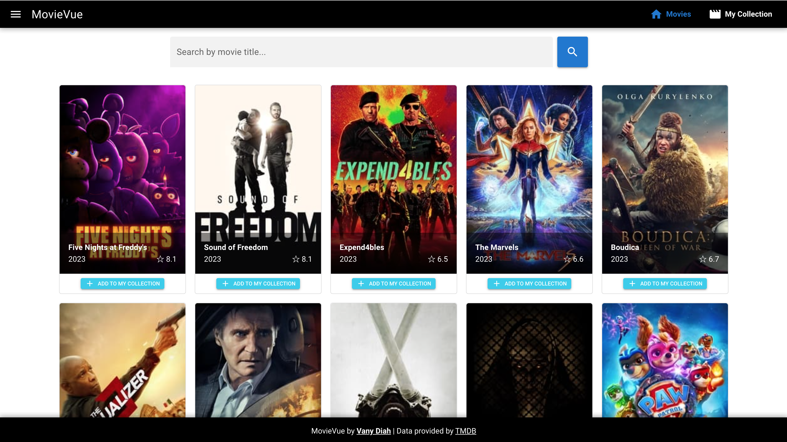
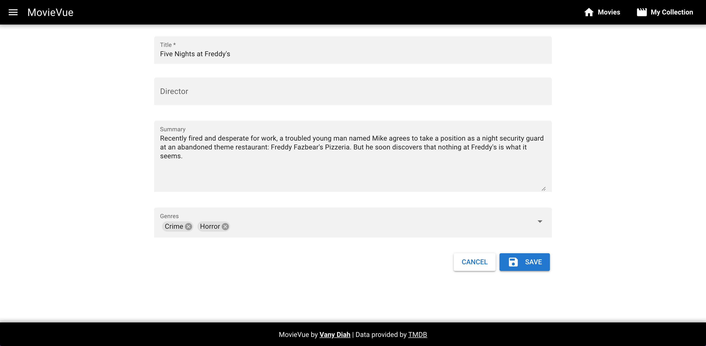

# MovieVue
A Movie Website using Vue and Quasar with simple CRUD

## Demo
Visit https://movie-vue-gamma.vercel.app/

### Screenshots
1. Homepage

<br />
2. Search

<br />
3. My Collection

<br />
4. Edit Form

<br />

### Set the token

To be able to carry out the requests, go to the quasar.config.js file
search for //env:{}, and replace with:
env:{
TOKEN: 'token value',
},


### Install the dependencies

```bash
yarn install
```

### Start the app in development mode (hot-code reloading, error reporting, etc.)

```bash
yarn dev
```

### Build the app for production

```bash
yarn build
```

### Customize the configuration

See [Configuring quasar.config.js](https://v2.quasar.dev/quasar-cli-vite/quasar-config-js).
